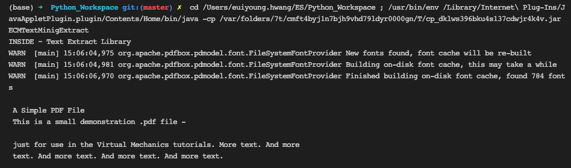
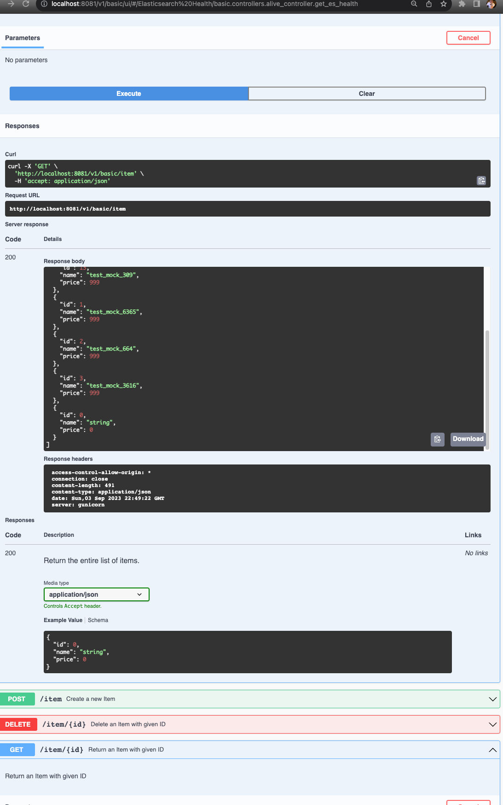
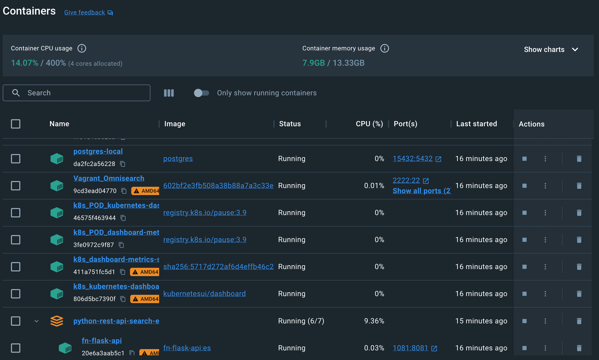
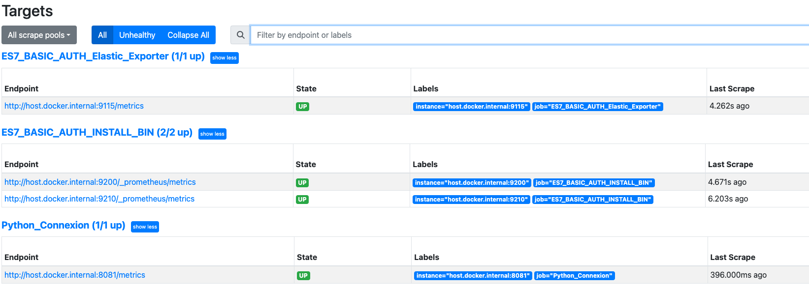
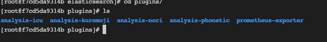
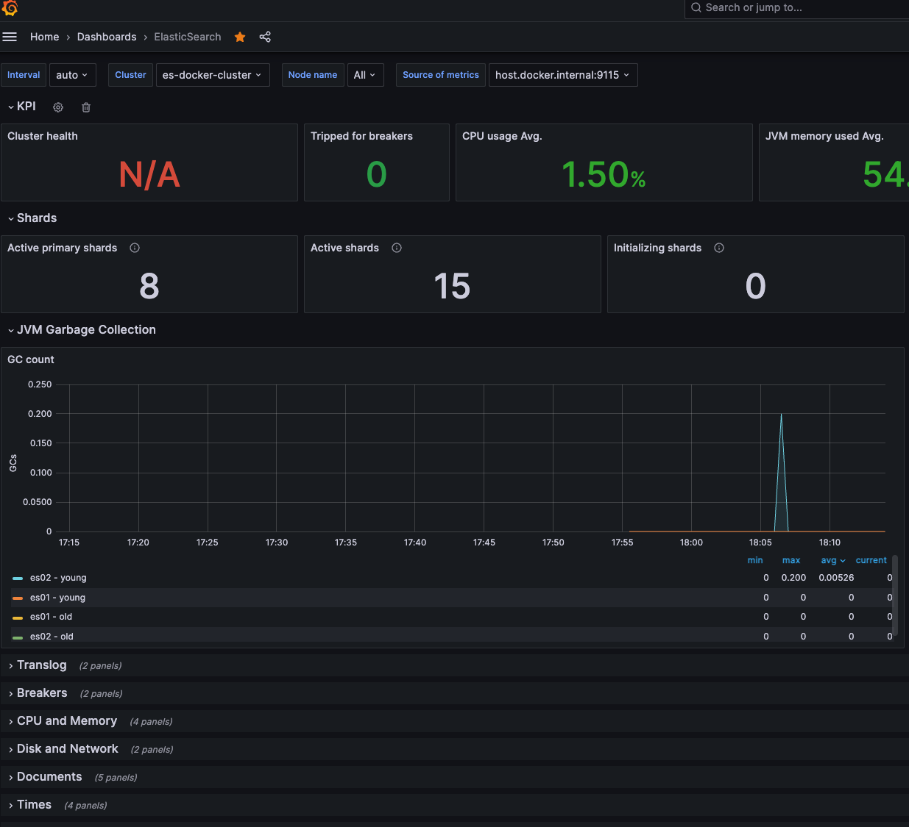
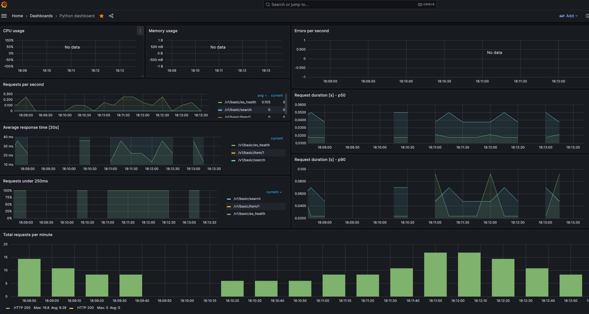

# euiyounghwang.github.io

#### Euiyoung Hwang (marieuig@gmail.com) / Linkedin(https://www.linkedin.com/in/euiyoung-hwang/) : Search, Data & AI Software Engineer

- __<i>Tools (Pycharm, Eclipse, Postman, VS Code, ELK, Jupyter, Databricks, Datadog, Grafana, Cerebro, Prometheus, Bonsai for Elasticsearch Cluster, Jira/Confluence)</i>__
- __<i>Environment (Vagrant, Anaconda/Miniconda, Python VirtualEnv/.venv, Docker&Docker-Compose, Poetry, Github, CircleCI, AWS)</i>__
- Programming (Python, Java, Flask, Flask/Rest-Flask/Fastapi:https://github.com/euiyounghwang/python-fastapi-vector-search, Flask-Connexion(https://github.com/euiyounghwang/python-flask-connexion-example-openapi3-master), Elasticsearch API, Databricks notebook, Google colab for implementation/testing AI model)
- Research, Develop and Deploy from Elasticsearch v1.7.3 ~ v7.9.X (Design, Develop and Deploy an  Elasticsearch Cluster between WAS and Data Feed application with DB and Documentum server for 7 years)
- Build and Deploy Search-Guard Community Edition (https://docs.search-guard.com/latest/search-guard-versions) as free in order to replace Elasticsearch X-Pack under license policy using BASIC_AUTH
- Interested with Elasticsearch v8 new features with Vectorized Search (https://github.com/euiyounghwang/semantic-search-elasticsearch-openai-langchain, https://github.com/euiyounghwang/python-fastapi-vector-search/tree/master <i>using FAISS Model which means we use Facebook AI Similarity Search (FAISS) to efficiently search for similar text</i>)
- Elasticsearch 1’st Deploy & Go Live Expert (Production : Elasticsearch Cluster with 24 Nodes, Log Cluster with 8 Nodes)  in South Korea (https://www.elastic.co/customers/posco)
- Search (Elasticsearch, Google Search Appliance) with Cluster, Design Index for Search, Restful API, Analyzer and Data Migration)
- Big Data Analysis (Elasticsearch, Logstash, Beat, Redis, MongoDB, NoSQL)
- Machine Learning with Scikit-Learn, NumPy, Pandas, Doc2Vec, Wor2vec, FastText and Tensorflow (distilbert), Keras, Text-Mining and NLP(Natural Language Processing) with Python v 3.5 ~
- Restful API (Socket, HTTP WebService with JSON based on Rest-Flask, Spring Boot Controller, Swagger UI API)
- Research new Technology for AI & Big Data (Jupyter with Anaconda)
- Project Leader & AI Engineer to <i>AI POS-ComplAi Project with AI Model based on Supervised Machine Learning Model</i> (News: http://bit.ly/2Ojc7Ij, https://www.donga.com/news/Economy/article/all/20200204/99522285/1, It requires to translate in English) in South Korea (In Addtion, I have implemented to extract duplicated documents using Doc2Vec model) - https://github.com/euiyounghwang/ES_Python_Project

I have ten years of experience in working with a modern search platform (Elasticsearch) and in building data pipelines(e.g https://github.com/euiyounghwang/python-search) & rest api services around it as a search engineer/senior software engineer. 
<i>Especially, I am an expert in the Search Engine with a bunch of api from elasticsearch and rest_api environment using python flask, fastapi, docker … because I handled the entire version of ES from 1.7 up to 7.9 V. such as building ES cluster, handling index mappings with a lof of analyzers, resolving complex query based on domain needs, ILM configuration and so on</i>

In FiscalNote (2022.07 ~ 2023.07), I contributed  to improve search relevance with complex queries such as func_score to adjust the weight to search results and  query performance with clusters. In more detail, I did the following:
- Improve search performance with reconsider sharding strategy Elasticsearch in large clusters and measure the search quality across multiple platforms using my performance tuning scripts based on Python
- Experience in building Elasticsearch cluster index configuration options, sharding, percolation,  ILM Configuration, and Elastic API Integration FN services (Query low latency, Index mapping changes with multilingual language, Redesign indexes mappings with dynamic templates)
- Design & build an Elasticsearch-powered search service to allow users to search accurately on Omnisearch Service (Python, OAS API, Flask,  Conda, Vagrant, Docker, RabbitMQ, Postgres, Elasticsearch/Percolator cluster, Git, CircleCI)

In particular, I remember that I have built and implemented Enterprise Search Services for seven years based on Elasticsearch in South Korea and had a success story interview at the elastic on seoul conference(https://www.youtube.com/watch?v=qu0IXwi3Fq0). At that time, I participated in the Google search engine replacement project(https://www.linkedin.com/pulse/elastic-tour-seoul-posco-ict-euiyoung-hwang/) as project leader and senior software engineer. 

The screenshots attached below are for __<i>the Success Story with Elasticsearch Interview, Elastic on Seoul Conference, 2018</i>__ (https://www.elastic.co/customers/posco)
when i worked as Senior Software Engineer & Search/Data Engineer at POSC ICT, South Korea (Received an award in POST ICT, 2016, https://media.licdn.com/dms/image/C512DAQGqaGMRMAXk9w/profile-treasury-image-shrink_1920_1920/0/1597560813194?e=1694487600&v=beta&t=sYbj3Kip8j_opHS_GB2ECOQ0FVhoiv16Jgsb2dxHp1M)


- Handle with Elasticsearch 1.7.3 ~ 7.9.0 (<i>Implement search service on entire version of Elaticsearch, gather all logs using Grok pattern using Logstash & Beat, Deploy Search Guard to ES cluster instead of X-Pack Shield</i>)
- 1'st Develop & Deploy the Elasticsearch with 24 Nodes (3 Masters. 2 clients, 19 Data Nodes) in South Korea - Monitoring with Spring Boot (https://github.com/euiyounghwang/Spring_Boot_Monitoring) instead of cerebro
- Korean Analyzer called Analysis-Nori(https://www.elastic.co/guide/en/elasticsearch/plugins/current/analysis-nori.html) developed from elastic after our requests because we have an issue with custom Korean Arirang, Mecab analyzers: I found the big issue on memory issue in the cluster)
- Design & Develop a novel java library based on Apache Tika to extract full text from various of documents such as MS-OFFICE, HWP, PDF and Text Format (https://github.com/euiyounghwang/ES_Python_Project, https://github.com/euiyounghwang/DocumentsTextExtract)
 (<i>Import java library into Python Environment for the unstructure texts in order to extract texts & index with meta datas into Elasticsearch</i>)
 
- Improve search relevance for client requirements with ranking weight
- Design & Create Index about more than 4,000 index with settings & mappings and index template for the client requirements
- Proper query implementation with Query DSL on Elasticsearch Cluster (https://github.com/euiyounghwang/GitHub_Guide)

if you want to watch the video, please go to this url (https://www.youtube.com/watch?v=qu0IXwi3Fq0) after set subtitled to English
(I was in the middle of guys)


Recently, I am personally implementing to Rest-Api Endpoint as test projects using python, flask/fastapi(https://github.com/euiyounghwang/python-fastapi-vector-search, https://github.com/euiyounghwang/python-flask-connexion-example-openapi3-master), and nestjs(https://github.com/euiyounghwang/nest-js-rest-api). The service allows you to search from a search engine (elasticsearch) and Postgres. It is also implemented based on Docker, and is being built, executed, and tested. Also I am interested with similary search such as huggingface embedding, vectorized search using Faiss and so on. (https://github.com/euiyounghwang/semantic-search-elasticsearch-openai-langchain)

#### <i>Rest-API on OPEN API Specifiation(Swagger)</i>
```yml
components:
  schemas:
    ..
    Search:
      type: object
      properties:
        query_string:
          type: string
          description: Full text search
          default: "Cryptocurrency"
          nullable: true
        start_date:
          type: string
          format: date
          description: Start date
          default: "2021 01-01 00:00:00"
        size:
          type: integer
          description: The number of size
          default: 20
        sort_order:
          type: string
          enum:
            - DESC
            - ASC
        include_basic_aggs:
          type: boolean
          description: Flag to enable/disabled aggregations which can slow down queries
        pit_id:
          type: string
          format: date
          description: pit_id
          example: ""
        ids_filter:
           type: array
           items:
            type: string
           default: ["*"]
    ..
```


#### <i>Docker in my local Environment</i>


Recently, I have been researching & implementing for search engine cluster monitoring and web application monitoring. In other words, we are testing to monitor search engines and restapi endpoints using prometheus and grafana. <i>Elasticsearch Prometheus Exporter is a builtin exporter from Elasticsearch to Prometheus. It collects all relevant metrics and makes them available to Prometheus via the Elasticsearch REST API</i>. This is an open source project - Cluster status, Node Status such as JVM, Indices, Circuit Breaker : the feature to prevent OOM occurrence

#### <i>Prometheus (Build Docker on my local environment with Elasticsearch-Exporter/Python-Export/FastAPI Plugin to gather all relevant metrics)</i>
- Monitoring all nodes in the cluster after installing prometheus-elasticsearch-exporter per each node (http://localhost:9191/targets?search=)

#### <i>Elasticsearch Cluster monitoring</i>
- Monitoring all nodes in the cluster after creating the metrics from elasticsearch_exporter docker instance
- See the metrics using elasticsearch exporter plugin after installing the library (http://localhost:9200/_prometheus/metrics)
 
```python
 elasticsearch_exporter plugin
 ...
# HELP es_jvm_mem_heap_max_bytes Maximum used memory in heap
# TYPE es_jvm_mem_heap_max_bytes gauge
es_jvm_mem_heap_max_bytes{cluster="es-docker-cluster",node="es01",nodeid="ENbXGy5ASPevQ3A5MPnZJg",} 1.073741824E9
# HELP es_index_indexing_delete_current_number Current rate of documents deleted
# TYPE es_index_indexing_delete_current_number gauge
es_index_indexing_delete_current_number{cluster="es-docker-cluster",index=".kibana_1",context="total",} 0.0
es_index_indexing_delete_current_number{cluster="es-docker-cluster",index=".security-7",context="total",} 0.0
es_index_indexing_delete_current_number{cluster="es-docker-cluster",index=".apm-custom-link",context="primaries",} 0.0
es_index_indexing_delete_current_number{cluster="es-docker-cluster",index=".security-7",context="primaries",} 0.0
es_index_indexing_delete_current_number{cluster="es-docker-cluster",index=".kibana_task_manager_1",context="primaries",} 0.0
es_index_indexing_delete_current_number{cluster="es-docker-cluster",index="test_omnisearch_v2",context="total",} 0.0
es_index_indexing_delete_current_number{cluster="es-docker-cluster",index=".kibana_1",context="primaries",} 0.0
es_index_indexing_delete_current_number{cluster="es-docker-cluster",index=".kibana-event-log-7.9.0-000001",context="primaries",} 0.0
es_index_indexing_delete_current_number{cluster="es-docker-cluster",index=".apm-agent-configuration",context="total",} 0.0
es_index_indexing_delete_current_number{cluster="es-docker-cluster",index=".apm-custom-link",context="total",} 0.0
es_index_indexing_delete_current_number{cluster="es-docker-cluster",index=".kibana-event-log-7.9.0-000001",context="total",} 0.0
es_index_indexing_delete_current_number{cluster="es-docker-cluster",index=".apm-agent-configuration",context="primaries",} 0.0
es_index_indexing_delete_current_number{cluster="es-docker-cluster",index=".kibana_task_manager_1",context="total",} 0.0
es_index_indexing_delete_current_number{cluster="es-docker-cluster",index="test_omnisearch_v2",context="primaries",} 0.0
# HELP es_index_recovery_current_number Current number of recoveries
...
```


#### <i>Python Webservice monitoring</i>
- Add prometheus library (https://pypi.org/project/prometheus-flask-exporter/) to track all endpoints into python-flask code using prometheus-flask-exporter
- Monitoring Httprequest response, status of requests and so on
```python
 http://localhost:8081/metrics
 ...
# TYPE flask_exporter_info gauge
flask_exporter_info{version="0.22.4"} 1.0
# HELP flask_http_request_duration_seconds Flask HTTP request duration in seconds
# TYPE flask_http_request_duration_seconds histogram
flask_http_request_duration_seconds_bucket{le="0.005",method="POST",path="/v1/basic/search",status="200"} 0.0
flask_http_request_duration_seconds_bucket{le="0.01",method="POST",path="/v1/basic/search",status="200"} 0.0
flask_http_request_duration_seconds_bucket{le="0.025",method="POST",path="/v1/basic/search",status="200"} 0.0
flask_http_request_duration_seconds_bucket{le="0.05",method="POST",path="/v1/basic/search",status="200"} 0.0
flask_http_request_duration_seconds_bucket{le="0.075",method="POST",path="/v1/basic/search",status="200"} 0.0
flask_http_request_duration_seconds_bucket{le="0.1",method="POST",path="/v1/basic/search",status="200"} 0.0
flask_http_request_duration_seconds_bucket{le="0.25",method="POST",path="/v1/basic/search",status="200"} 1.0
flask_http_request_duration_seconds_bucket{le="0.5",method="POST",path="/v1/basic/search",status="200"} 1.0
flask_http_request_duration_seconds_bucket{le="0.75",method="POST",path="/v1/basic/search",status="200"} 1.0
flask_http_request_duration_seconds_bucket{le="1.0",method="POST",path="/v1/basic/search",status="200"} 1.0
flask_http_request_duration_seconds_bucket{le="2.5",method="POST",path="/v1/basic/search",status="200"} 1.0
flask_http_request_duration_seconds_bucket{le="5.0",method="POST",path="/v1/basic/search",status="200"} 1.0
flask_http_request_duration_seconds_bucket{le="7.5",method="POST",path="/v1/basic/search",status="200"} 1.0
flask_http_request_duration_seconds_bucket{le="10.0",method="POST",path="/v1/basic/search",status="200"} 1.0
flask_http_request_duration_seconds_bucket{le="+Inf",method="POST",path="/v1/basic/search",status="200"} 1.0
flask_http_request_duration_seconds_count{method="POST",path="/v1/basic/search",status="200"} 1.0
flask_http_request_duration_seconds_sum{method="POST",path="/v1/basic/search",status="200"} 0.11475991699990118
...
```
