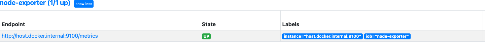

# Euiyoung Hwang's Profile

__<i>Euiyoung Hwang (marieuig@gmail.com) / Linkedin(https://www.linkedin.com/in/euiyoung-hwang/) : Search, Data & AI Software Engineer</i>__

- __<i>Tools (Pycharm, Eclipse, Postman, Spring Boot, VS Code, ELK, Apache Kafka, Apache Tika, Jupyter, Databricks, Datadog, Grafana, Cerebro, Prometheus, AlertManager with Slack alert, Oracle, MongoDB, Postgres, Redis, RabbitMQ, Apache Tomcat, Bonsai for Elasticsearch/Opensearch Cluster, Kibana/Opensearch-dashboard, Jupyter, Google Colab for testing the AI model, Google Search Appliance, Bash Shell, Jira/Confluence, Postman/Insomnia for validating Restful API, K9s for kubernetis, Docker/Docker-Compose (i.e Docker with Search Engine - <i>https://github.com/euiyounghwang/python-search_engine/blob/master/docker-compose.yml</i>), DockerHub with my account)</i>__
- <i>__Environment__ (Vagrant, Anaconda/Miniconda, Python VirtualEnv/.venv, Golang Env, Docker&Docker-Compose, Poetry, Github, Bash Script, CircleCI, Amazon Web Serivice)</i>
- __<i>Certification/Learning Courses__ : `ELASTICSEARCH DEVELOPER II, San Francisco, USA, CORE ELASTICSEARCH: DEVELOPER, San Francisco, USA, CORE ELASTICSEARCH: OPERATIONS, San Francisco, USA`, SAS@Data Scientist, South Korea, Search: Advanced Deployments (Part 3), Taiwan, 
Google Apps Partner Training Apps200 - Technical Bootcamp, South Korea, Google Apps Partner Training Apps200 - Technical Bootcamp, South Korea
Google, __Microsoft Certified Application Developer (MCAD) .NET, Microsoft Certified Professional (MCP)__</i>
- __<i>Platform Repository__ : Build & create local environment & tools such as Apach Kafka, Rabbitmq, Elasticsearch/Opensearch/Solr, Prometheus, Grafana, Postgres an so on with docker and python virtualenv and test them using some scripts (<i>https://github.com/euiyounghwang/python-platform-engine/tree/master</i>)
- <i>__Programming__ : Golang(Learning.., Backend Restful API using Gin HTTP web framework - <i>https://github.com/euiyounghwang/go-search_engine<i>), Python Web Stacks(Flask, FastAPI, Django) - FastAPI (<i>https://github.com/euiyounghwang/python-fastapi-vector-search, https://github.com/euiyounghwang/python-fastapi-basic</i>), Flask-Connexion(<i>https://github.com/euiyounghwang/python-flask-connexion-example-openapi3-master, https://github.com/euiyounghwang/python-flask-basic</i>, Django & Django Rest Framework (<i>https://github.com/euiyounghwang/python-django</i>) with Docker&Docker-Compose, Elasticsearch API, Databricks notebook, gRPC/Thrift, Java, Spring Boot, Google colab for implementation/testing AI model), Web Stack(Javascript/Jquery, HTML, CSS, XML, ASP), Socket/Client/Emulator Programming(TCP/UDP, docker-compose : <i>https://github.com/euiyounghwang/Algorithm/blob/master/Network/Socket/docker-compose.yml, Dockerfile: https://github.com/euiyounghwang/Algorithm/tree/master/Network/Socket/TCP/server</i>)

- Building Flask-Connexion Basic Framework based on Postgres for CRUD Operation, Elasticsearch including docker, Kafka producer/consumer (<i>https://github.com/euiyounghwang/python-flask-basic/tree/master/tools/kafka</i>) and Rabbitmq producer/consumer (<i>https://github.com/euiyounghwang/python-flask-basic/tree/master/tools/rabbitmq</i>) in Restful API Service and tools.
- Building FastAPI Framework based on Search Engine such as Elasticsearch/Opensearch including docker, Kafka producer/consumer (<i>https://github.com/euiyounghwang/python-search_engine/blob/master/kafka/READMD.md</i>), Kafka-Logstash-Elasticsearch, Kafka-Prometheus-Exporter for monitoring, Elasticsearch Curator, pytest, search api service, shell scripts for elasticsearch/opensearch cluster and performance test environment (https://github.com/euiyounghwang/python-search_engine</i>)
- Building Django & Django REST Framework (DRF, Swagger with `'drf_yasg'`) with Poetry dependency management and Python Virtual Enviroment by using Postgres & Elasticsearch : <i>REST API for DB model with CRUD, REST API & Frontend (<i>https://github.com/euiyounghwang/python-django/blob/master/screenshots/Django-rest_ui-search.png</i>) with template for search results</i>, unit tests for elasticsearch query, rest_api for Postgres, Redis, Elasticsearch using pytest-django, Ingestion Script for Database with Postgres, Mongodb, <i>Push Docker image into DockerHub with my account after running on CircleCi</i> (Repo : <i>https://github.com/euiyounghwang/python-django/tree/master</i>)

  
- Build, Develope and Deploy from Elasticsearch v1.7.3 ~ v7.9.X (Design, Develop and Deploy an  Elasticsearch Cluster between WAS and Data Feed application with DB and Documentum server with our Enterprise Search Service for 7 years)
- Implementation 'Ingest Application' to collect the dataset from the different types of source such as Oracle, Postgres, Web contents and other sources for BatchJob using Java, Python
- Build and Deploy Search-Guard Community Edition (<i>https://docs.search-guard.com/latest/search-guard-versions</i>) as free in order to replace Elasticsearch X-Pack under license policy using BASIC_AUTH
- __<i>Build REST API Services (Enterprise Search, Omnisearch, Text Prediction API AI Model Service with training, Documentum Service using Socket Server) based on Flask, Fastapi & Django Web Framework, Spring Boot Framework, AI model such as Text Classification using Supervised Model(FastText, Logistic Regression, SVM, KNN), Similarity Search using Doc2Vec Model (<i>https://github.com/euiyounghwang/ES_Python_Project/tree/master/Snapshot)</i>) and Spring Boot as backend services</i>__
- Interested with Elasticsearch v8 new features with Vectorized Search (<i>https://github.com/euiyounghwang/semantic-search-elasticsearch-openai-langchain, https://github.com/euiyounghwang/python-fastapi-vector-search/tree/master</i> __<i>using FAISS Model which means we use Facebook AI Similarity Search (FAISS) to efficiently search for similar text</i>__)


- Elasticsearch 1’st Deploy & Go Live Expert (Production : Elasticsearch Cluster with 24 Nodes, Log Cluster with 8 Nodes)  in South Korea (<i>https://www.elastic.co/customers/posco</i>)
- Search (Elasticsearch, Google Search Appliance) with Cluster, Design Index for Search, Restful API, Analyzer and Data Migration)
- Big Data Analysis (Elasticsearch, Logstash, Beat, Redis, MongoDB, NoSQL, Apache Kafka, RabbitMQ, Databrick)
- Machine Learning with Scikit-Learn, NumPy, Pandas, Doc2Vec, Wor2vec, FastText and Tensorflow (distilbert), Keras, Text-Mining and NLP(Natural Language Processing) with Python v 3.5 ~
- Restful API (Socket, HTTP WebService with JSON based on Rest-Flask, Spring Boot MVC Architecture, Swagger UI API)
- Project Leader & AI Engineer for <i>AI POS-ComplAi Project with AI Model based on Supervised Machine Learning Model</i> (News: <i>http://bit.ly/2Ojc7Ij, https://www.donga.com/news/Economy/article/all/20200204/99522285/1</i>, It requires to translate in English) in South Korea (In Addtion, I have implemented a text model to extract & look up the duplicated documents using Doc2Vec model - <i>Screenshot : https://github.com/euiyounghwang/ES_Python_Project/tree/master/Snapshot</i>)

I have ten years of experience in working with a modern search platform (Elasticsearch, Google Search Appliance with Google Apps) and in building data pipelines(e.g <i>https://github.com/euiyounghwang/python-search</i>) & rest api services around it as a search engineer/senior software engineer. 
<i>Especially, I am an expert in the Search Engine with a bunch of api from elasticsearch and rest_api environment using Python Web Stacks with Docker because I have been handling the entire version of ES from 1.7 up to 7.9 (i.e building ES cluster from the scrach, handling index mappings with a lof of analyzers and resolving complex query based on domain needs)</i>

In FiscalNote (2022.07 ~ 2023.07), I contributed  to improve search relevance with complex queries such as func_score to adjust the weight to search results and  query performance with clusters. In more detail, I did the following:
- Improve search performance with reconsider sharding strategy and optimize Elasticsearch large clusters by fine-tuning configuration. It used to measure the search quality across multiple platforms using my performance tuning scripts based on Python.(<i>Peformance Metrics - e.g: https://github.com/euiyounghwang/euiyounghwang.github.io/blob/master/screenshot/performance_results_example.png</i>)
- Experience in building Elasticsearch cluster index configuration options, sharding, percolation,  ILM Configuration, and Elastic API Integration FN services (Query low latency, Index mapping changes with multilingual language, Redesign indexes mappings with dynamic templates)
- Design & build an Elasticsearch-powered search service to allow users to search accurately on Omnisearch Service (<i>Python, OAS API, Flask,  Conda, Vagrant, Docker, RabbitMQ</i>(<i>Producer: https://github.com/euiyounghwang/python-fastapi-vector-search/blob/master/rmq_message_send.sh</i>), Postgres, Elasticsearch/Percolator cluster, Git, CircleCI)
- Monitoring ES Cluster with our production services by using <i>Grafana, Datadog, Kibana and participating in On-Call Rotation (Provide timely response and resolution to production issues)</i>

In particular, I remember that I have been building and implementing 'Enterprise Search Services' for seven years based on Elasticsearch in South Korea. As a result of my contributions that I was having a success story interview at the elastic on seoul conference(<i>https://www.youtube.com/watch?v=qu0IXwi3Fq0</i>). At that time, I participated in the Google search engine replacement project(<i>https://www.linkedin.com/pulse/elastic-tour-seoul-posco-ict-euiyoung-hwang/</i>) as project leader and senior software engineer. 

The screenshots attached below are for __<i>the Success Story with Elasticsearch Interview, Elastic on Seoul Conference, 2018</i>__ (https://www.elastic.co/customers/posco)
when i worked as Senior Software Engineer & Search/Data Engineer at POSC ICT, South Korea (Received an award in POST ICT, 2016, <i>https://media.licdn.com/dms/image/C512DAQGqaGMRMAXk9w/profile-treasury-image-shrink_1920_1920/0/1597560813194?e=1694487600&v=beta&t=sYbj3Kip8j_opHS_GB2ECOQ0FVhoiv16Jgsb2dxHp1M</i>)


- Handle with Elasticsearch 1.7.3 ~ 7.9.0 (<i>Implement search service on entire version of Elaticsearch, gather all logs using Grok pattern using Logstash & Beat, Deploy Search Guard to ES cluster instead of X-Pack Shield</i>)
- 1'st Develop & Deploy the Elasticsearch with 24 Nodes (3 Masters. 2 clients, 19 Data Nodes) in South Korea - Monitoring with Spring Boot (<i>https://github.com/euiyounghwang/Spring_Boot_Monitoring</i>) instead of cerebro
- Korean Analyzer called Analysis-Nori(<i>https://www.elastic.co/guide/en/elasticsearch/plugins/current/analysis-nori.html</i>) developed from elastic after our requests because we have an issue with custom Korean Arirang, Mecab analyzers: I found the big issue on memory issue in the cluster)
- Design & Develop a novel java library based on Apache Tika to extract full text from various of documents such as MS-OFFICE, HWP, PDF and Text Format (<i>https://github.com/euiyounghwang/ES_Python_Project, https://github.com/euiyounghwang/DocumentsTextExtract</i>)
 (<i>Import java library into Python Environment for the unstructure texts in order to extract texts & index with meta datas into Elasticsearch</i>)
 
- Improve search relevance for client requirements with ranking weight
- Design & Create Index about more than 4,000 index with settings & mappings and index template for the client requirements
- Proper query implementation with Query DSL on Elasticsearch Cluster (<i>https://github.com/euiyounghwang/GitHub_Guide</i>)

if you want to watch the video, please go to this url (<i>https://www.youtube.com/watch?v=qu0IXwi3Fq0</i>) after set subtitled to English
(I was in the middle of guys)


Recently, I am personally implementing to Rest-Api Endpoint as test projects using python, flask/fastapi(<i>https://github.com/euiyounghwang/python-fastapi-vector-search, https://github.com/euiyounghwang/python-flask-connexion-example-openapi3-master</i>), and nestjs(<i>https://github.com/euiyounghwang/nest-js-rest-api</i>). The service allows you to search from a search engine (elasticsearch) and Postgres. It is also implemented based on Docker, and is being built, executed, and tested. Also I am interested with similary search such as huggingface embedding, vectorized search using Faiss and so on. (<i>https://github.com/euiyounghwang/semantic-search-elasticsearch-openai-langchain</i>)

#### <i>Rest-API on OPEN API Specifiation(Swagger)</i>
```yml
components:
  schemas:
    ..
    Search:
      type: object
      properties:
        query_string:
          type: string
          description: Full text search
          default: "Cryptocurrency"
          nullable: true
        start_date:
          type: string
          format: date
          description: Start date
          default: "2021 01-01 00:00:00"
        size:
          type: integer
          description: The number of size
          default: 20
        sort_order:
          type: string
          enum:
            - DESC
            - ASC
        include_basic_aggs:
          type: boolean
          description: Flag to enable/disabled aggregations which can slow down queries
        pit_id:
          type: string
          format: date
          description: pit_id
          example: ""
        ids_filter:
           type: array
           items:
            type: string
           default: ["*"]
    ..
```


#### <i>Docker in my local Environment</i>


I have set up & tested to monitor with alert throught slack such as search engines, restapi endpoints and other application's metrics using prometheus, alertmanager and  grafana. <i>Elasticsearch Prometheus Exporter is a builtin exporter from Elasticsearch to Prometheus. It collects all relevant metrics and makes them available to Prometheus via the Elasticsearch REST API</i>. This is an open source project - Cluster status, Node Status such as JVM, Indices, Circuit Breaker : the feature to prevent OOM occurrence

- Prometheus (<i>https://prometheus.io/download/, https://yoo11052.tistory.com/201</i>) is an open-source monitoring system that collects metrics from your application and stores them in a time series database. It can be used to monitor the performance of your application and alert you when something goes wrong

Likewise, you can access Grafana and check the added rules in Alerting/Alert rules(<i>)http://localhost:3001/alerting/list</i> from the external alertmanager

- The Alertmanager(<i>http://localhost:9091/alerts?search, http://localhost:9093/#/alerts, http://localhost:9093/api/v2/alerts</i>) handles alerts sent by client applications such as the Prometheus server. Alerting with Prometheus is separated into two parts. Alerting rules in Prometheus servers send alerts to an Alertmanager. 
```
# Alertmanager Configuration
alerting:
  alertmanagers:
    - static_configs:
      - targets: ['host.docker.internal:9093']

# loading at once and evaluate the rule periodically based on 'evaluation_interval'
rule_files:
  - "/alertmanager/alert.rules"
```
- The Alertmanager then manages those alerts, including silencing, inhibition, aggregation and sending out notifications via methods such as email, chat platforms such as slack(<i>https://api.slack.com/apps</i>) with created app and on-call notification systems.

- Alert rules are defined in Prometheus configuration. Prometheus just scrapes (pull) metrics from its client application(the Node Exporter). However, if any alert condition hits, Prometheus pushes it to the AlertManager which manages the alerts through its pipeline of silencing, inhibition, grouping and sending out notifications.
- Here is a basic architecture of Alertmanager with Prometheus (https://medium.com/devops-dudes/prometheus-alerting-with-alertmanager-e1bbba8e6a8e)

- This configuration is based on the architecture described below :

- Elasticserach Exporter : This is a builtin exporter from Elasticsearch to Prometheus. It collects all relevant metrics and makes them available to Prometheus via the Elasticsearch REST API. (https://github.com/vvanholl/elasticsearch-prometheus-exporter/, https://blog.naver.com/PostView.naver?blogId=whddbsml&logNo=222405287424)
- Python Exporter (https://pypi.org/project/prometheus-flask-exporter/)
- Node Exporter : The node_exporter is designed to monitor the host system. It's not recommended to deploy it as a Docker container because it requires access to the host system (https://github.com/prometheus/node_exporter/, https://github.com/prometheus/node_exporter/releases/download/v1.6.1/node_exporter-1.6.1.darwin-amd64.tar.gz)

```
  # My local environment to install node-exporter Docker instance
  # docker run --rm -p 9100:9100 prom/node-exporter 
  # docker compose up -d node-exporter
  node_exporter:
    # http://localhost:9100/metrics
    image: prom/node-exporter
    container_name: node_exporter
    depends_on:
      - prometheus
    restart: always
    ports:
    - 9100:9100
```

- RabbitMQ Exporter : Prometheus exporter for RabbitMQ metrics. Data is scraped by prometheus. You can install plugin promethus from RabbitMQ Plugin (https://www.rabbitmq.com/prometheus.html)
```
# Install Plugin
/opt/homebrew/opt/rabbitmq/sbin/rabbitmq-plugins enable rabbitmq_prometheus
brew services restart rabbitmq

# Prometheus.yml
- job_name: rabbitmq-exporter
  scrape_interval: 10s
  metrics_path: "/metrics"
  static_configs:
  - targets: ['host.docker.internal:15692']
```

#### <i>Prometheus (Build Docker on my local environment with Elasticsearch-Exporter/Python-Export/FastAPI Plugin to gather all relevant metrics)</i>
- Monitoring all nodes in the cluster after installing prometheus-elasticsearch-exporter per each node (http://localhost:9191/targets?search=)

#### <i>Elasticsearch Cluster monitoring</i>
- Monitoring all nodes in the cluster after creating the metrics from elasticsearch_exporter docker instance
- See the metrics using elasticsearch exporter plugin after installing the library (http://localhost:9200/_prometheus/metrics)
 
 
```python
 elasticsearch_exporter plugin
 ...
# HELP es_jvm_mem_heap_max_bytes Maximum used memory in heap
# TYPE es_jvm_mem_heap_max_bytes gauge
es_jvm_mem_heap_max_bytes{cluster="es-docker-cluster",node="es01",nodeid="ENbXGy5ASPevQ3A5MPnZJg",} 1.073741824E9
# HELP es_index_indexing_delete_current_number Current rate of documents deleted
# TYPE es_index_indexing_delete_current_number gauge
es_index_indexing_delete_current_number{cluster="es-docker-cluster",index=".kibana_1",context="total",} 0.0
es_index_indexing_delete_current_number{cluster="es-docker-cluster",index=".security-7",context="total",} 0.0
es_index_indexing_delete_current_number{cluster="es-docker-cluster",index=".apm-custom-link",context="primaries",} 0.0
es_index_indexing_delete_current_number{cluster="es-docker-cluster",index=".security-7",context="primaries",} 0.0
es_index_indexing_delete_current_number{cluster="es-docker-cluster",index=".kibana_task_manager_1",context="primaries",} 0.0
es_index_indexing_delete_current_number{cluster="es-docker-cluster",index="test_omnisearch_v2",context="total",} 0.0
es_index_indexing_delete_current_number{cluster="es-docker-cluster",index=".kibana_1",context="primaries",} 0.0
es_index_indexing_delete_current_number{cluster="es-docker-cluster",index=".kibana-event-log-7.9.0-000001",context="primaries",} 0.0
es_index_indexing_delete_current_number{cluster="es-docker-cluster",index=".apm-agent-configuration",context="total",} 0.0
es_index_indexing_delete_current_number{cluster="es-docker-cluster",index=".apm-custom-link",context="total",} 0.0
es_index_indexing_delete_current_number{cluster="es-docker-cluster",index=".kibana-event-log-7.9.0-000001",context="total",} 0.0
es_index_indexing_delete_current_number{cluster="es-docker-cluster",index=".apm-agent-configuration",context="primaries",} 0.0
es_index_indexing_delete_current_number{cluster="es-docker-cluster",index=".kibana_task_manager_1",context="total",} 0.0
es_index_indexing_delete_current_number{cluster="es-docker-cluster",index="test_omnisearch_v2",context="primaries",} 0.0
# HELP es_index_recovery_current_number Current number of recoveries
...
```


#### <i>Python Webservice monitoring</i>
- Add prometheus library (https://pypi.org/project/prometheus-flask-exporter/) to track all endpoints into python-flask code using prometheus-flask-exporter
- Monitoring Httprequest response, status of requests and so on
```python
 http://localhost:8081/metrics
 ...
# TYPE flask_exporter_info gauge
flask_exporter_info{version="0.22.4"} 1.0
# HELP flask_http_request_duration_seconds Flask HTTP request duration in seconds
# TYPE flask_http_request_duration_seconds histogram
flask_http_request_duration_seconds_bucket{le="0.005",method="POST",path="/v1/basic/search",status="200"} 0.0
flask_http_request_duration_seconds_bucket{le="0.01",method="POST",path="/v1/basic/search",status="200"} 0.0
flask_http_request_duration_seconds_bucket{le="0.025",method="POST",path="/v1/basic/search",status="200"} 0.0
flask_http_request_duration_seconds_bucket{le="0.05",method="POST",path="/v1/basic/search",status="200"} 0.0
flask_http_request_duration_seconds_bucket{le="0.075",method="POST",path="/v1/basic/search",status="200"} 0.0
flask_http_request_duration_seconds_bucket{le="0.1",method="POST",path="/v1/basic/search",status="200"} 0.0
flask_http_request_duration_seconds_bucket{le="0.25",method="POST",path="/v1/basic/search",status="200"} 1.0
flask_http_request_duration_seconds_bucket{le="0.5",method="POST",path="/v1/basic/search",status="200"} 1.0
flask_http_request_duration_seconds_bucket{le="0.75",method="POST",path="/v1/basic/search",status="200"} 1.0
flask_http_request_duration_seconds_bucket{le="1.0",method="POST",path="/v1/basic/search",status="200"} 1.0
flask_http_request_duration_seconds_bucket{le="2.5",method="POST",path="/v1/basic/search",status="200"} 1.0
flask_http_request_duration_seconds_bucket{le="5.0",method="POST",path="/v1/basic/search",status="200"} 1.0
flask_http_request_duration_seconds_bucket{le="7.5",method="POST",path="/v1/basic/search",status="200"} 1.0
flask_http_request_duration_seconds_bucket{le="10.0",method="POST",path="/v1/basic/search",status="200"} 1.0
flask_http_request_duration_seconds_bucket{le="+Inf",method="POST",path="/v1/basic/search",status="200"} 1.0
flask_http_request_duration_seconds_count{method="POST",path="/v1/basic/search",status="200"} 1.0
flask_http_request_duration_seconds_sum{method="POST",path="/v1/basic/search",status="200"} 0.11475991699990118
...
```


#### <i>Elastic Stack Monitoring</i>
- Metricbeat is a lightweight shipper that you can install on your servers to periodically collect metrics from the operating system and from services running on the server
- Monitoring system metrics to Prometheus or Kibana tools using Metribeat
```
wget https://artifacts.elastic.co/downloads/beats/metricbeat/metricbeat-8.8.0-linux-arm64.tar.gz
tar -zxvf metricbeat-8.8.0-linux-arm64.tar.gz
cd metricbeat-8.8.0-linux-arm64/
./metricbeat setup -e
./metricbeat -e
```

- Add Variable to Prometheus Dashboard
```
{"find": "terms", "field": "host.name"}
```


- Build a dashboard using Grafana or Kibana like the above (Metricbeat to Elasticsearch with all relevant metrics)
```
- Metricbeat Service Registry
sudo cp /home/devuser/ES/metricbeat-8.8.0-linux-arm64/metricbeat  /usr/local/bin/metricbeat
sudo chown devuser metricbeat.yml
sudo chown devuser /usr/local/bin/

/usr/local/bin/metricbeat -e --path.home=/home/devuser/ES/metricbeat-8.8.0-linux-arm64

--
sudo vi /etc/systemd/system/metricbeat.service

[Unit]
Description=Metricbeat Service
After=multi-user.target

[Service]
Type=simple
User=devuser
Group=devuser
WorkingDirectory=/home/devuser/ES/metricbeat-8.8.0-linux-arm64
#ExecStart=/home/devuser/ES/metricbeat-8.8.0-linux-arm64b/start_metricbeat.sh
ExecStart=/usr/local/bin/metricbeat -e --path.home=/home/devuser/ES/metricbeat-8.8.0-linux-arm64
Restart=on-failure

[Install]
WantedBy=multi-user.target

-- Service Registry
sudo systemctl daemon-reload
# Autostart when rebooting
sudo systemctl enable metricbeat.service
# start to service
sudo systemctl start metricbeat.service
sudo systemctl status metricbeat.service

-- Log check
journalctl -u metricbeat.service
```
